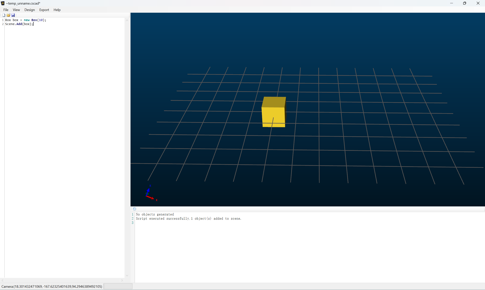

# SharpCAD
SharpCAD is a free software that creates 3D objects using scripts, similar to OpenSCAD. However, it uses C# scripts and currently only supports Windows. Although it is currently only a free software and not open source, it will be open sourced in the future.
Like OpenSCAD, SharpCAD provides two main modeling techniques:

1、Constructive Solid Geometry (CSG): SharpCAD defines 2D objects such as Circle and Square, as well as 3D basic objects like Box and Sphere. However, unlike OpenSCAD, you need to use +, -, and * operators for Boolean union, difference, and intersection operations.

2、Extrusion, rotation, and other operations based on 2D profiles.

Currently, SharpCAD can export modeling results as OFF and OBJ files. Additionally, you can save your creations as scripts for other scripts to use.

# Coding a simple script?
You can write CSCAD scripts just like writing C# code in Visual Studio. For example, you can create a Box and add it to the scene, and you will see a cube in the scene：

    Box box = new Box(10);
    Scene.Add(box);

You can save the script to local path or export it as an OFF/OBJ file.

# Contents
- [3rd-party libraries](#3rd-party-libraries)
- [Examples](#Examples)
- [Done and TODO](#Done-and-TODO)
- [API Reference](#API-Reference)

# 3rd-party libraries
* [FastColoredTextBox](https://github.com/PavelTorgashov/FastColoredTextBox) 
* [Newtonsoft.Json](https://github.com/JamesNK/Newtonsoft.Json/)
* [scriptcs-engines](https://github.com/scriptcs/scriptcs-engines)
* [Open Cascade](https://www.Opencascade.com/)
* [AvalonEdit](https://github.com/icsharpcode/AvalonEdit)
* [Clipper2](https://github.com/AngusJohnson/Clipper2)
* [Autofac](https://github.com/autofac/Autofac)
* [CShell](https://github.com/lukebuehler/CShell)
* [MPFR](https://www.mpfr.org/)
* [CGAL](https://www.cgal.org/)
* [GMP](https://gmplib.org/)  
* [TBB](https://github.com/oneapi-src/oneTBBhttps://gmplib.org/)  

# Examples
Currently, only 8 examples are provided, and all examples are located in the 'examples' directory.
## Cube
    Box box = new Box(22,16,14);
    Scene.Add(box);

## CSG
    Sphere sphere = new Sphere(10);
    Box box = new Box(15);

    //Union
    ShapeBase union = box + sphere;
    union.Translate(-24,0,0);

    //Intersect
    ShapeBase intersection = box * sphere;

    //Diffrence
    ShapeBase difference = box - sphere;
    difference.Translate(24,0,0);

    //Scene.Add(box);
    Scene.Add(union);
    Scene.Add(intersection);
    Scene.Add(difference);

## Linear_Extrude
    //Simple Linear_Extrude
    Square square = new Square(20, 10);
    var linear0 = ACOCCTTools.Linear_Extrude(square,20);
    linear0.Translate(0, -30, 0);
    linear0.Color = Color.Red;

    Scene.Add(linear0);

## rotate_extrude
    //Square Rotate_Extrude
    Square square = new Square(5);
    square.Translate(10,0,0);
    var re0 = ACOCCTTools.Rotate_Extrude(square,360);
    re0.Color = Color.Red;
    Scene.Add(re0);

    //PolyFace Rotate_Extrude
    List<Point3D> pnts = new List<Point3D>()
    {
        new Point3D (0,0,0),
        new Point3D (8,4,0),
        new Point3D (4,8,0),
        new Point3D (4,12,0),
        new Point3D (12,16,0),
        new Point3D (0,20,0)
    };
    PolyFace face = new PolyFace(pnts);

    var re1 = ACOCCTTools.Rotate_Extrude(face ,360);
    re1.Translate(0,30,0);
    re1.Color = Color.Green;
    Scene.Add(re1);

    //complex Rotate_Extrude
    {
        Square square0 = new Square(5);
        square0 .Color = Color.Magenta;
        var square1 = square0.Clone();
        square1.Translate(12.5,0,0);
        var re2 = ACOCCTTools.Rotate_Extrude(square1,180);
        re2.Translate(40,40,0);

        var square2 = square0.Clone();
        square2.Translate(5,0,0);
        var re3 = ACOCCTTools.Rotate_Extrude(square2,180);
        re3.Translate(7.5,0,0);
        re3.Translate(40,40,0);

        var square3 = square0.Clone();
        square3.Translate(5,0,0);
        var re4 = ACOCCTTools.Rotate_Extrude(square3,-180);
        re4.Translate(-7.5,0,0);
        re4.Translate(40,40,0);

        Scene.Add(re2);
        Scene.Add(re3);
        Scene.Add(re4);
    }

## import_off_and_projection
    //import off and project triangleMesh
    String strFile       = @"examples\data\elephant.off";
    TriangleMesh triMesh = ACOCCTTools.Import(strFile);

    triMesh.Translate(0, 0, 1);
    triMesh.Scale(10,10,10);
    Scene.Add(triMesh);
    triMesh.Color = Color.Blue;
    var faces = ACOCCTTools.Projection(triMesh);

    //set color
    foreach(var item in faces)
    {
        item .Color=Color.Red;
    }
    Scene.Add(faces);
    
    //ShapeBase
    Box b = new Box(10);
    b.Translate(0, 20, 10);
    var faces1 = ACOCCTTools.Projection(b);

    faces1[0].Color=Color.Green;
    Scene.Add(faces1);
    Scene.Add(b);

## load_other_cscad_file
    #load "examples\roundedSqura.cscad"
    /*Actually, I'm not very familiar with design, but I managed to design an unknown three-dimensional part 
    that is not very coordinated using SharpCAD.
    Author:AfricChang
    //#load directive should be placed at the beginning of the file!!!!
    */

    //1、part base
    //load other cscad file\
    #load "examples\roundedSqura.cscad"
    double dOuterHeight=40,dOuterWidth=24;
    double dInnerHeight=5,dInnerWidth=3,dRadius=1;
    double dTranslateX=3,dTranslateY=2;
    double dHeight=3;

    PolyFace face = CreateRoundedSquare(dOuterHeight,dOuterWidth);
    PolyFace f0 = CreateRoundedSquare(dInnerHeight,dInnerWidth,dRadius);

    var f1=f0.Clone();
    var f2=f0.Clone();
    var f3=f0.Clone();

    //bottom left inner face
    f0.Translate(dTranslateX,dTranslateY,0);
    //bottom right inner face
    f1.Translate(dOuterHeight-dTranslateX-dInnerHeight,
        dTranslateY,0);
    //top right inner face
    f2.Translate(dOuterHeight-dTranslateX-dInnerHeight,
        dOuterWidth - dTranslateY-dInnerWidth,0);
    //top left inner face
    f3.Translate(dTranslateX,
        dOuterWidth - dTranslateY-dInnerWidth,0);
    //the biggest face subtract four corner faces
    var face_base=face-f0-f1 -f2-f3;

    var part_base= ACOCCTTools.Linear_Extrude(face_base,dHeight);
    //Scene.Add(part_base);

    //2、part top
    //create a face with arc extrude rotate and translate
    double dR=5,dRsmall=2;;

    List<Point3D> pts =new List<Point3D>();
    pts.Add(new Point3D(dTranslateX,0,0));
    pts.Add(new Point3D(dOuterHeight,0,0));

    //calc arc center , arc start angle(0) and end angle
    double dArcCenterX = dOuterHeight-dR;
    //22.5=> Math.Atan2(dOuterHeight-dTranslate,dOuterHeight-dTranslate)/2;
    double dArcCenterY = dOuterHeight-dTranslateX- dR/Math.Tan(22.5*Math.PI/180);

    double dArcEndAngle=157.5;//180-22.5;

    //Create an arc with a center point of (dArcCenterX, dArcCenterY), 
    //start angle is 0, and an end angle is dArcEndAngle
    int nPtCount=10;
    double dStep=dArcEndAngle/nPtCount;
    for(int i=0;i<nPtCount;i++)
    {
        double dAngle=(i*dStep*Math.PI/180);
        double dX=dArcCenterX+dR*Math.Cos(dAngle);
        double dY=dArcCenterY+dR*Math.Sin(dAngle);
        Point3D pt= new Point3D(dX,dY,0);
        pts.Add(pt);
    }

    PolyFace face_top_base = new PolyFace(pts);

    Circle innerCircle= new Circle(dRsmall);
    innerCircle=(Circle)innerCircle.Translate(dArcCenterX,dArcCenterY,0);
    var fff_top=face_top_base-innerCircle;

    //extrude fff_top
    var part_top = ACOCCTTools.Linear_Extrude(fff_top,dHeight);

    //rotate and translate part_top
    part_top.Rotate(90,0,0);
    part_top.Translate(0,(dOuterWidth+dHeight)/2,dHeight);

    //union part_top part_base
    var part= part_top+part_base;
    Scene.Add(part);

## triangleMesh Boolean
    //import off and boolean
    String strFile        = @"examples\data\elephant.off";
    TriangleMesh triMesh0 = ACOCCTTools.Import(strFile);
    triMesh0.Scale(10,10,10);

    String strFile1  = @"examples\data\eight.off";
    TriangleMesh triMesh1 = ACOCCTTools.Import(strFile1);
    triMesh1.Scale(10,10,10);

    var triBoolean = triMesh1-triMesh0;
    triBoolean.Color = Color.Green;
    Scene.Add(triBoolean );

    triMesh0.Translate(-15,0, 0);
    triMesh1.Translate(-15, 0, 0);

    triMesh0.Color = Color.Red;
    Scene.Add(triMesh0);

    triMesh1.Color = Color.Green;
    Scene.Add(triMesh1);

## create_TriangleMesh
    Point3D[] pts = new Point3D[3] {
	new Point3D(0,0,0),
	new Point3D(10,0,0),
	new Point3D(10,10,0),
	};
	
    Indeces id0 = new Indeces(0,-1,-1);
    Indeces id1 = new Indeces(1,-1,-1);
    Indeces id2 = new Indeces(2,-1,-1);
    TriangleIndex[] ids = new TriangleIndex[1]{new TriangleIndex(id0,id1,id2)};
    TriangleMesh tri = new TriangleMesh(pts,ids,null,null);
    Scene.Add(tri);

# Done-and-TODO
## Compared to OpenSCAD, the following partial features are already supported:
* 2D primitives are already supported, but text is not yet supported. TODO
* projection cut parameter not not supported,TODO
* Linear extrude is partially supported, with the 'twist', 'slices', and 'scale' parameters not yet supported, TODO. But the remaining parameters will not be considered for support.
* Rotate extrude is not yet supported with the '$fn' parameter, but it can be set in triangulation using 'dAngleDelta'. It may be supported in the future during export or rendering.
* import,Currently, only the OFF format is supported for imports. OBJ, STL, DXF, etc TODO.
* BooleanOperation is already supported
## TODO
* Improve existing features.
* Text support.
* Mirror
* Sweep
* Loft
* Plane cut mesh
* Plane mesh intersection
* More examples
* Custom plugin
* ......

# API Reference
Currently, all modeling operations are in the ACC namespace(OCCTModeling.dll).
The ACC namespace provides basic Point2D, Point3D, geometric primitives, and related operations.
## Geometric primitives
This includes 2D and 3D geometric primitives. All 2D and 3D primitives (except TriangleMesh) inherit from ShapeBase and can be rotated (using the Rotate method), translated (using the Translate method), scaled (using the Scale method), projected, and undergo Boolean operations (using the +, -, and * symbols). In addition, two-dimensional primitives can also be stretched and rotated-stretched. ShapeBase can be exported after triangulation.

### Circle
    Circle 2D
    Circle(double radius)//Create a circle with a specified radius.

### Square
    Square
    Square(double height, double width, bool bCenter)//Specify the length, width, and whether the center point is at the origin
    Square(double height, double width)//Specify the length, width, and center point at the origin.
    Square(double size, bool bCenter)//length = width = height = size , and whether the center point is at the origin
    Square(double size)//length = width = height = size ,and center point at the origin.

### PolyFace
    polygon
    PolyFace(List<Point3D> verteces, List<List<int>> indeces)//Create a polygon with holes by specifying vertices and indices. Note that polygons with holes are supported, and the first face needs to be drawn in a counterclockwise direction, while subsequent faces that serve as holes should be drawn in a clockwise direction.
    PolyFace(List<Point3D> verteces)//simple polygon

### Box
    Box
    Box(double dLength, double dWidth, double dHeight, bool bCenter)//Specify the length, width, height, and whether the center point is at the origin.
    Box(double dLength, double dWidth, double dHeight)//Specify the length, width, and height, with the center point at the origin.
    Box(double size, bool bCenter)//The length, width, and height are all size, and whether the center point is at the origin.
    Box(double size)//The length, width, and height are all size, with the center point at the origin.

### Sphere
    Sphere
    Sphere(double dRadius)//Specify the radius to create a sphere.

### Cylinder
    Cylinder
    Cylinder(double dTopRadius, double dBottomRadius, double dHeight)//Specify the top radius, bottom radius, and height to create a cylinder.
    Cylinder(double dRadius, double dHeight)//Create a cylinder with equal top and bottom dRadius and a height of dHeight.

### Torus
    Torus
    Torus(double dRadius, double dRingRadius, double dSweepAngle)//Specify the radius of the circle, the radius of the pipe, and the sweeping angle. Note that the sweeping angle starts from the X-axis and sweeps counterclockwise in degrees.

### TriangleMesh
    Triangle Mesh
    The imported OFF (currently only supports OFF, and other formats such as OBJ and STL will be supported in the future) and the triangulated result of the geometric primitive.
    
* public TriangleMesh(Point3D[] verteces, TriangleIndex[] triangles, Point3D[] normals, Point2D[] textureCoods)//A triangle mesh can be constructed based on vertices, indices, normals, and texture coordinates, where normals and texture coordinates can be null.
* TriangleIndex construction =>public TriangleIndex(Indeces index0, Indeces index1, Indeces index2)//Indeces construction => public Indeces(int nID, int nUV, int nNormal)
* Please refer to the example for constructing a triangle mesh.[create_TriangleMesh](##create_TriangleMesh)

## Opearations
All operations are contained within ACC.ACOCCTTools and mainly include operations such as rotation, translation, scaling, projection, and Boolean operations.

### Transform
* public static void Translate(ShapeBase shape, double x, double y, 
    double z)//Translate ShapeBase
* public static void Translate(ShapeBase shape, Point3D translate)//Translate ShapeBase

* public static void Rotate(ShapeBase shape, double x, double y, 
    double z)//Rotate ShapeBase measured in degree
* public static void Rotate(ShapeBase shape, Point3D rotate)//Rotate ShapeBase measured in degree

* public static void Scale(ShapeBase shape, double x, double y, double z)//Scale ShapeBase
* public static void Scale(ShapeBase shape, Point3D scale)//Scale ShapeBase

### Opearation
* public static TriangleMesh BooleanOperation(TriangleMesh triMeshA, TriangleMesh triMeshB, BooleanType eBoType)//Boolean operations can be performed on triangle meshes, where BooleanType includes three types: Intersection, Union, and Difference. Note that if performing Boolean operations between ShapeBase primitives and triangle meshes, the ShapeBase primitives must first be triangulated into triangle meshes before the operation can be performed."
    
* public static TriangleMesh Trianguation(ShapeBase shape, double dAngleDelta, double dLengthDelta)//Triangulate the ShapeBase primitive, where dAngleDelta is the angle threshold and dLengthDelta is the length threshold.

* public static ShapeBase Linear_Extrude(ShapeBase shape, double height)//Linear_Extrude ShapeBase

* public static ShapeBase Rotate_Extrude(ShapeBase shape, double dAngle)//Rotate_Extrude ShapeBase

* public static TriangleMesh Import(string strFileName)//import file currently only support OFF file

* public static List<PolyFace> Projection(ShapeBase shape)//project ShapeBase
* public static List<PolyFace> Projection(TriangleMesh triMesh)//project TriangleMesh 
* public static Combine(List<TriangleMesh>)//Combine TriangleMeshs

# Easter egg
Although importing files in other formats is not currently supported, they can be imported using other libraries and converted to a TriangleMesh. An external DLL can be loaded using the #r load command, in fact you can more things by loading external dll, as shown below:
    
    #r "\examples\data\geometry3.dll"
    g3.Vector3f g= new g3.Vector3f(10,10,10);
    SharpCADConsole.WriteLine(g.Length);

